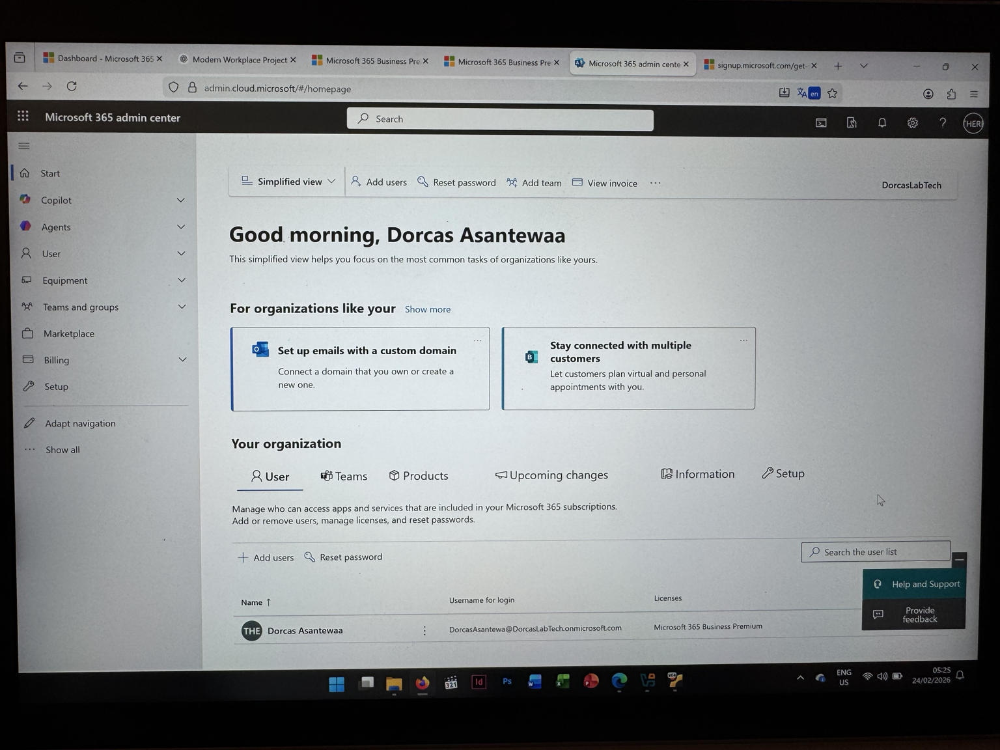
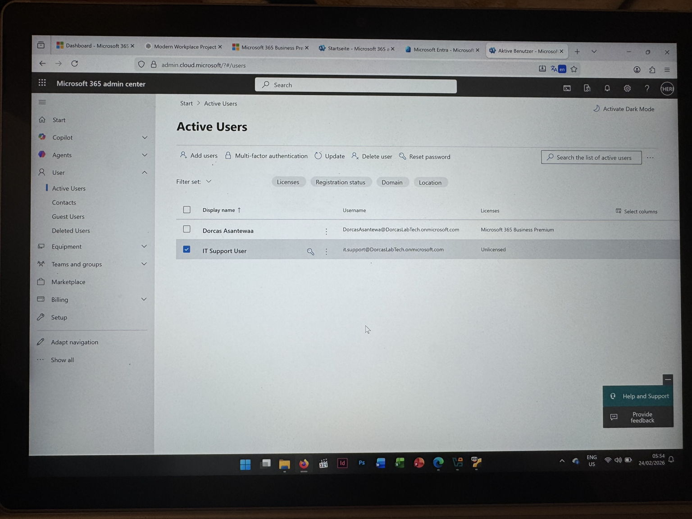
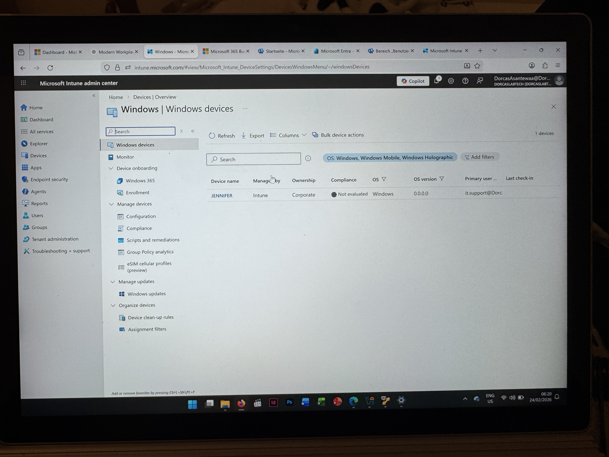
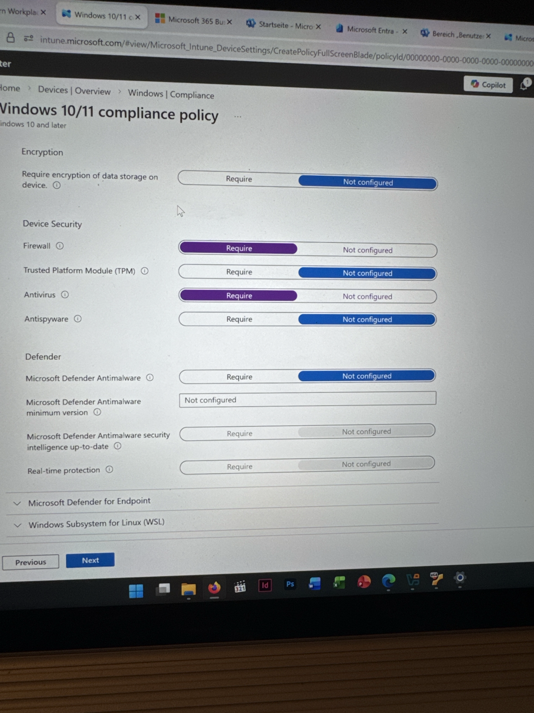
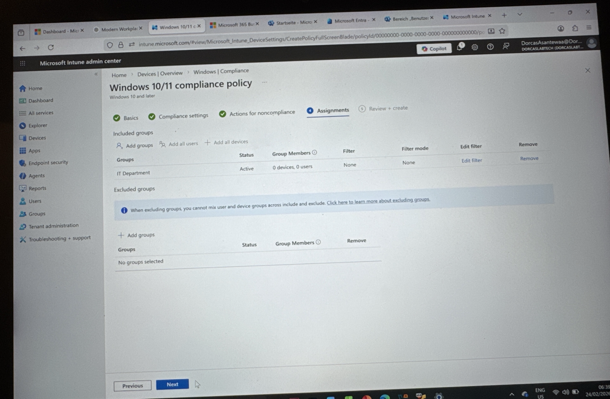
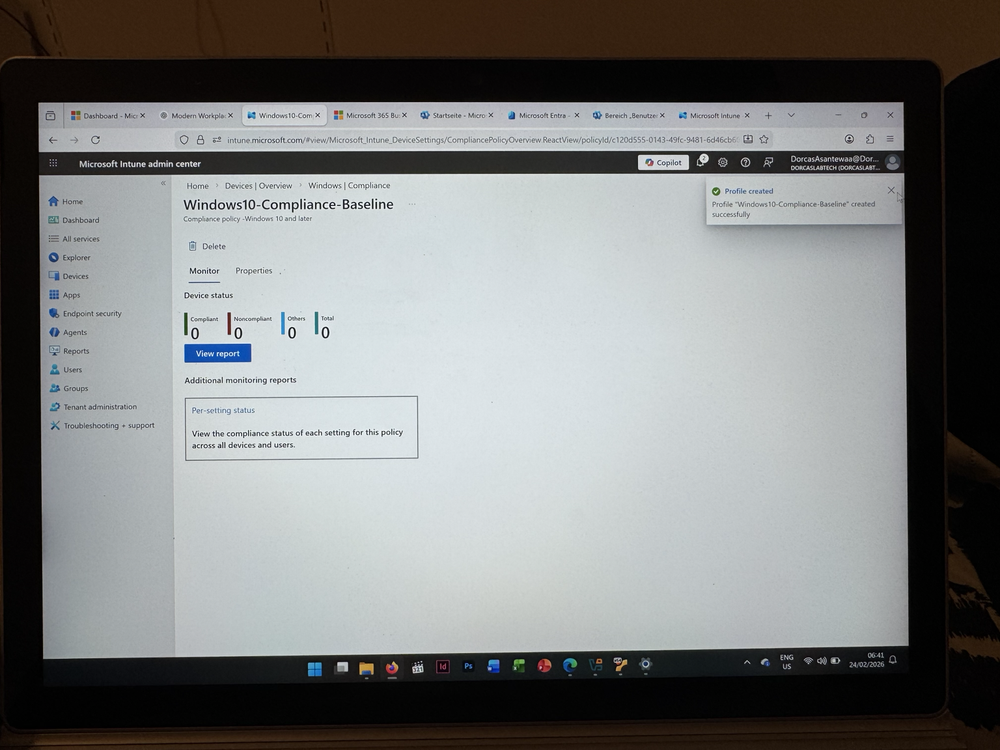

# Microsoft Intune Windows 10/11 Compliance Policy Lab

## Project Overview
This project demonstrates how to create a Windows 10/11 compliance policy using Microsoft Intune to enforce device security rules.

The goal is to ensure that only compliant and secure devices can access company resources.

## Technologies Used
- Microsoft Intune
- Microsoft Entra ID
- Windows 10/11 Compliance Policies
- Endpoint Security

## Key Security Configurations
- BitLocker encryption enforcement
- Secure Boot requirement
- TPM requirement
- Microsoft Defender Antivirus requirement
- Password complexity policy
- Non-compliance device actions

## Assignment
The policy was assigned to the **IT Department** group to simulate an enterprise deployment scenario.

## Screenshots
Screenshots showing the policy configuration steps will be included in the **Screenshots** folder.

## Key Screenshots

### Microsoft 365 Admin Dashboard

### Active Users in Microsoft 365

### Device Visible in Intune

### Compliance Security Settings

### Policy Assignment to IT Department

### Compliance Policy Successfully Created

